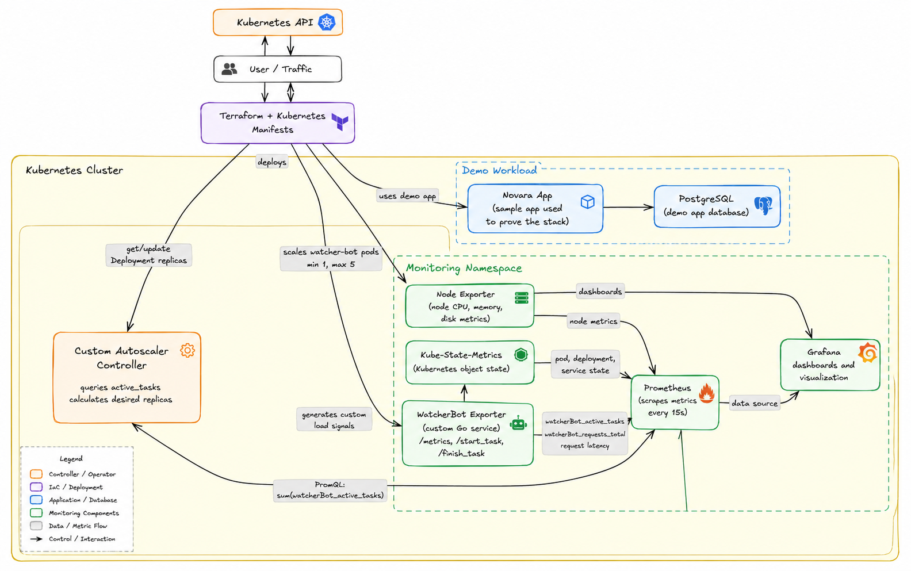
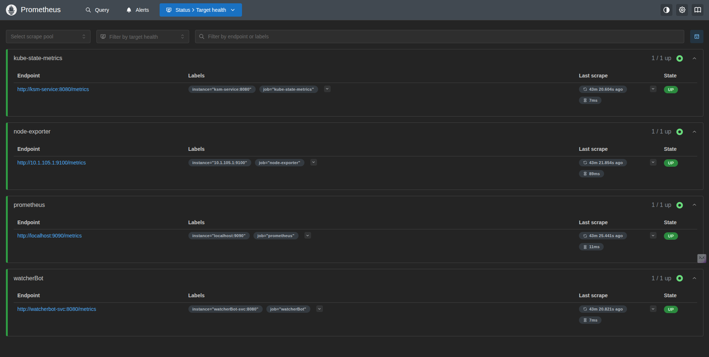
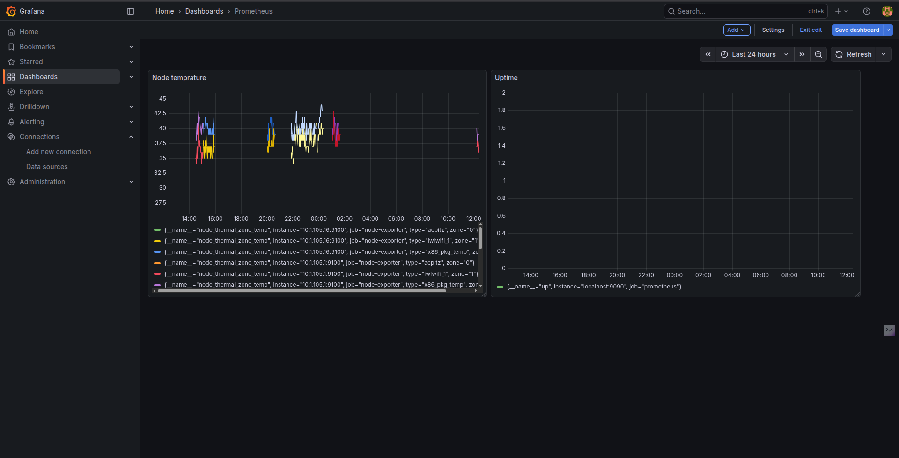

# Kubernetes Monitoring & Autoscaling System

A production-grade monitoring and autoscaling stack built from scratch using Prometheus, Grafana, and custom metrics exporters on Kubernetes. This project demonstrates infrastructure-as-code practices, Kubernetes operator patterns, and real-time autoscaling based on custom application metrics.

> **Blog Series**: I documented the entire journey of building this system. Check out [Phase 1: Building the Monitoring Stack](https://shivamchaubey.live/blog/building-a-kubernetes-monitoring-stack-from-scratch-phase-1/) for the detailed walkthrough.

## What This Project Does

Instead of relying on basic CPU/memory-based autoscaling, this system:
- Collects **custom application metrics** from a Go service (WatcherBot)
- Stores and queries them using **Prometheus**
- Makes **intelligent scaling decisions** based on real application behavior through a custom autoscaler controller
- Automatically adjusts pod replicas through the **Kubernetes API**
- Visualizes everything in **Grafana dashboards**
- Runs entirely in containerized environments with proper Docker multi-stage builds

The entire infrastructure is managed as code using **Terraform**, making it reproducible and version-controlled.

## Architecture



**Components**:
- **Prometheus**: Time-series database scraping metrics every 15s
- **Node Exporter**: Hardware and OS-level metrics from each node
- **Kube-State-Metrics**: Kubernetes object state metrics (pods, deployments, etc.)
- **Grafana**: Dashboards and alerting
- **WatcherBot**: Custom Go exporter exposing application metrics (`watcherBot_active_tasks`)
- **Autoscaler Controller**: Custom Go controller that queries Prometheus and scales deployments based on tasks-to-replica ratio

## Tech Stack

- **Infrastructure**: Kubernetes (MicroK8s), Terraform
- **Monitoring**: Prometheus, Grafana, custom exporters
- **Programming**: Go (custom metrics exporter and autoscaling controller)
- **Containerization**: Docker (multi-stage builds for optimized images)
- **IaC**: Terraform (HCL)
- **CI/CD**: Docker Compose for local development

## Project Structure

```
infrastructure/
├── k8s/                           # Kubernetes manifests (YAML)
│   ├── app.yaml                   # Sample application deployment
│   ├── ingress.yaml               # Ingress configuration
│   ├── postgres.yaml              # PostgreSQL setup
│   └── secrets.yaml               # Secrets management
│
├── monitoring/                    # Monitoring stack manifests
│   ├── grafana.yaml               # Grafana deployment + service
│   ├── grafana-pvc.yaml           # Persistent storage for dashboards
│   ├── prometheus-deployment.yaml # Prometheus server
│   ├── prometheus-config.yaml     # Scrape configs (what to monitor)
│   ├── prometheus-pvc.yaml        # Time-series data storage
│   ├── prometheus-rbac.yaml       # ServiceAccount + permissions
│   ├── prometheus-service.yaml    # ClusterIP service
│   ├── node-exporter-daemonset.yaml    # Node metrics (runs on every node)
│   ├── node-exporter-service.yaml
│   ├── kube-state-metrics.yaml    # K8s object metrics + RBAC
│   └── watcher-bot.yaml           # Custom app with /metrics endpoint
│
└── terraform/                     # Infrastructure as Code
    ├── main.tf                    # Provider configuration
    ├── monitoring.tf              # Complete monitoring stack in HCL
    ├── variables.tf               # Configurable parameters
    └── terraform.tfstate          # State management

autoscaler-controller/             # Custom autoscaling controller
├── main.go                        # Controller logic with Prometheus queries
├── Dockerfile                     # Multi-stage build for optimized image
├── go.mod
└── go.sum

watcherbot-exporter/               # Custom metrics exporter
├── main.go                        # Exposes /metrics with custom gauges
├── Dockerfile                     # Multi-stage build
├── go.mod
└── go.sum

novara-app/                        # Full-stack application (bonus)
├── client/                        # React + TypeScript frontend
├── server/                        # Node.js backend
├── Dockerfile                     # Application containerization
└── compose.yaml                   # Docker Compose setup
```

## Getting Started

### Prerequisites

- Kubernetes cluster (I'm using MicroK8s, but any K8s works)
- `kubectl` configured
- Terraform >= 1.0
- Docker (for building custom images)
- Go 1.24+ (if modifying the controllers)

### Option 1: Deploy with Kubernetes Manifests

This is the manual way – you learn exactly what's happening.

```bash
# Create monitoring namespace
kubectl create namespace monitoring

# Deploy Prometheus stack
kubectl apply -f infrastructure/monitoring/prometheus-rbac.yaml
kubectl apply -f infrastructure/monitoring/prometheus-config.yaml
kubectl apply -f infrastructure/monitoring/prometheus-pvc.yaml
kubectl apply -f infrastructure/monitoring/prometheus-deployment.yaml
kubectl apply -f infrastructure/monitoring/prometheus-service.yaml

# Deploy exporters
kubectl apply -f infrastructure/monitoring/node-exporter-daemonset.yaml
kubectl apply -f infrastructure/monitoring/node-exporter-service.yaml
kubectl apply -f infrastructure/monitoring/kube-state-metrics.yaml

# Deploy Grafana
kubectl apply -f infrastructure/monitoring/grafana-pvc.yaml
kubectl apply -f infrastructure/monitoring/grafana.yaml

# Deploy custom app (WatcherBot)
kubectl apply -f infrastructure/monitoring/watcher-bot.yaml
```

**Verify everything is running:**
```bash
kubectl get pods -n monitoring
kubectl get svc -n monitoring
```

### Option 2: Deploy with Terraform

This is the infrastructure-as-code approach – one command to rule them all.

```bash
cd infrastructure/terraform

# Initialize Terraform
terraform init

# Review what will be created
terraform plan

# Deploy the entire stack
terraform apply
```

**What Terraform creates:**
- `monitoring` namespace
- Prometheus with RBAC (ServiceAccount, ClusterRole, ClusterRoleBinding)
- Persistent volumes for Prometheus and Grafana
- Node Exporter DaemonSet (runs on all nodes)
- Kube-State-Metrics deployment
- Grafana deployment
- All required services

**Tear it down:**
```bash
terraform destroy
```

## Building and Deploying Custom Controllers

### WatcherBot Exporter

The WatcherBot is a custom Go application that exposes three endpoints:
- `/metrics` - Prometheus metrics endpoint
- `/start_task` - Increments `watcherBot_active_tasks` gauge
- `/finish_task` - Decrements `watcherBot_active_tasks` gauge

**Build and deploy:**
```bash
cd watcherbot-exporter

# Build the Docker image
docker build -t watcherbot-exporter:latest .

# Tag for your registry (optional)
docker tag watcherbot-exporter:latest <your-registry>/watcherbot-exporter:latest

# Push to registry
docker push <your-registry>/watcherbot-exporter:latest

# Update the image in watcher-bot.yaml and apply
kubectl apply -f infrastructure/monitoring/watcher-bot.yaml
```

### Autoscaler Controller

The autoscaler controller implements intelligent scaling based on the tasks-to-replica ratio:
- **Target TTR**: 10 tasks per replica
- **Min Replicas**: 1
- **Max Replicas**: 5
- **Scaling Interval**: 15 seconds

**How it works:**
1. Queries Prometheus for `sum(watcherBot_active_tasks)`
2. Calculates desired replicas: `ceil(active_tasks / TARGET_TTR)`
3. Updates deployment replicas via Kubernetes API if needed
4. Logs all scaling decisions for audit

**Build and deploy:**
```bash
cd autoscaler-controller

# Build the Docker image
docker build -t autoscaler-controller:latest .

# Deploy to Kubernetes (ensure RBAC is configured)
kubectl apply -f <your-autoscaler-manifest>.yaml
```

**Key implementation details:**
- Uses in-cluster config when running in K8s, falls back to `~/.kube/config` for local testing
- Implements exponential backoff for Prometheus query failures
- Logs comprehensive state information for debugging

## Configuration Deep Dive

### Prometheus Scrape Targets

The `prometheus-config.yaml` defines what Prometheus monitors:

```yaml
scrape_configs:
  - job_name: 'prometheus'
    static_configs:
      - targets: ['localhost:9090']    # Prometheus monitoring itself
  
  - job_name: 'node-exporter'
    kubernetes_sd_configs:             # Auto-discovery of node exporters
      - role: endpoints
        namespaces:
          names: [monitoring]
    relabel_configs:
      - source_labels: [__meta_kubernetes_service_label_app]
        regex: node-exporter
        action: keep
  
  - job_name: 'kube-state-metrics'
    static_configs:
      - targets: ['ksm-service:8080']
  
  - job_name: 'watcherBot'
    static_configs:
      - targets: ['watcherBot-svc:8080']
```

**Key concepts:**
- **Static configs**: Hardcoded targets (simple, but not dynamic)
- **Kubernetes service discovery**: Prometheus finds targets automatically using K8s API
- **Relabel configs**: Filter which endpoints to scrape based on labels

### Autoscaler Algorithm

The controller uses a simple but effective algorithm:

```go
TARGET_TTR = 10.0  // Target tasks per replica

desiredReplicas = ceil(activeTasks / TARGET_TTR)

if desiredReplicas > MAX_REPLICAS {
    desiredReplicas = MAX_REPLICAS
} else if desiredReplicas < MIN_REPLICAS {
    desiredReplicas = MIN_REPLICAS
}
```

**Example scenarios:**
- 5 active tasks → 1 replica (below min)
- 25 active tasks → 3 replicas
- 48 active tasks → 5 replicas (capped at max)
- 0 active tasks → 1 replica (maintains minimum)

### RBAC Setup

Both Prometheus and the autoscaler controller need permissions to interact with Kubernetes resources. The RBAC setup grants:

**Prometheus:**
- **Nodes**: To discover node exporters
- **Pods/Services/Endpoints**: To scrape application metrics
- **ConfigMaps/Secrets**: (Read-only) For configuration

**Autoscaler Controller:**
- **Deployments**: Get and Update permissions
- **Pods**: Read permissions for monitoring
- **Events**: Create permissions for audit logging

This is done via:
1. **ServiceAccount**: Identity for pods
2. **ClusterRole**: Permissions definition
3. **ClusterRoleBinding**: Ties the ServiceAccount to the ClusterRole

### Resource Management

Each component has resource requests and limits to prevent resource contention:

```yaml
resources:
  requests:
    memory: "256Mi"
    cpu: "250m"
  limits:
    memory: "512Mi"
    cpu: "500m"
```

This ensures:
- Kubernetes can schedule pods efficiently
- No single component starves others
- Cluster remains stable under load

## Accessing the Stack

### Port Forwarding (Development)

```bash
# Prometheus
kubectl port-forward -n monitoring svc/prometheus-service 9090:80

# Grafana
kubectl port-forward -n monitoring svc/grafana-svc 3000:80

# WatcherBot (to manually trigger tasks)
kubectl port-forward -n monitoring svc/watcherbot-svc 8088:8088
```

Then open:
- Prometheus: http://localhost:9090
- Grafana: http://localhost:3000 (default: admin/admin)
- WatcherBot: http://localhost:8088/metrics

### NodePort (Production-ish)

If you used the Grafana manifest with NodePort:
```bash
# Get the node IP
kubectl get nodes -o wide

# Access Grafana at http://<NODE_IP>:32000
```

## Testing the Autoscaler

### Manual Testing

Simulate load by hitting the WatcherBot endpoints:

```bash
# Start tasks (increases active_tasks gauge)
for i in {1..25}; do
  curl http://localhost:8088/start_task
done

# Watch the autoscaler logs
kubectl logs -f -n monitoring <autoscaler-pod-name>

# Verify scaling happened
kubectl get deployment watcher-bot -n monitoring -w

# Finish tasks (decreases active_tasks gauge)
for i in {1..20}; do
  curl http://localhost:8088/finish_task
done
```

### Expected Behavior

```
Active Tasks | Expected Replicas | Reason
-------------|-------------------|------------------
0-10         | 1                 | Minimum replicas
11-20        | 2                 | ceil(15/10) = 2
21-30        | 3                 | ceil(25/10) = 3
31-40        | 4                 | ceil(35/10) = 4
41-50        | 5                 | ceil(45/10) = 5
50+          | 5                 | Maximum replicas
```

## Exploring Metrics

### 1. Verify Prometheus Targets

Go to Prometheus UI → Status → Targets

You should see all scrape jobs in **UP** state:
- prometheus
- node-exporter
- kube-state-metrics
- watcherBot

### 2. Query Some Metrics

Try these in the Prometheus query interface:

```promql
# CPU usage per node
rate(node_cpu_seconds_total{mode="idle"}[5m])

# Memory usage
node_memory_MemAvailable_bytes / node_memory_MemTotal_bytes

# Pod count per namespace
kube_pod_info

# Custom app metrics (from WatcherBot)
watcherbot_requests_total
watcherBot_active_tasks

# Scaling behavior over time
sum(watcherBot_active_tasks)
```

### 3. Build Grafana Dashboards

1. Add Prometheus as a data source in Grafana
2. Import community dashboards:
   - **Node Exporter Full**: Dashboard ID `1860`
   - **Kubernetes Cluster Monitoring**: Dashboard ID `7249`
3. Create custom dashboards for:
   - WatcherBot active tasks over time
   - Deployment replica count correlation
   - Autoscaling decisions timeline

## What I Learned

### Technical Skills
- How Prometheus scrapes and stores time-series data
- Kubernetes RBAC and why every component needs a ServiceAccount
- The difference between DaemonSet (node-exporter) and Deployment (Prometheus)
- Why PersistentVolumes matter (Prometheus loses data on pod restart without them)
- Converting imperative kubectl commands to declarative Terraform
- **Writing custom Kubernetes controllers that interact with the K8s API**
- **Querying Prometheus programmatically from Go applications**
- **Docker multi-stage builds for minimizing image sizes**
- **Implementing intelligent autoscaling logic based on custom metrics**

### The Hard Parts
- **RBAC debugging**: Spent 2 hours figuring out why Prometheus couldn't discover pods (missing `list` permission)
- **PVC issues**: MicroK8s needs `microk8s-hostpath` storage class, not `standard`
- **Terraform state management**: Learned the hard way that renaming resources breaks everything
- **Service discovery**: Understanding Kubernetes endpoints vs services vs pods
- **In-cluster config**: Autoscaler controller needed proper ServiceAccount to access K8s API from within the cluster
- **Prometheus query syntax**: Understanding PromQL aggregations and when to use `sum()` vs `rate()`
- **Race conditions**: Handling rapid scaling events without thrashing

### Key Insights
- **Start simple**: I manually deployed everything first, then converted to Terraform
- **Check /metrics endpoints**: Before configuring Prometheus, verify the exporter actually exposes metrics
- **kubectl logs is your friend**: Most issues were configuration mistakes caught in logs
- **Terraform plan is free**: Always run it before apply
- **Custom metrics > CPU-based autoscaling**: Domain-specific metrics lead to better scaling decisions
- **Multi-stage Docker builds are worth it**: Reduced image size from 1.2GB to 20MB
- **Always implement min/max bounds**: Prevents runaway scaling

## Some Images of the Execution



## Project Status

### ✅ Completed Phases

**Phase 1: Monitoring Foundation**
- Prometheus deployment with persistent storage
- Node Exporter for hardware metrics
- Kube-State-Metrics for Kubernetes insights
- Grafana dashboards

**Phase 2: Infrastructure as Code**
- Complete Terraform conversion
- RBAC configuration
- ConfigMap management
- Service definitions

**Phase 3: Custom Metrics Exporter**
- WatcherBot Go application
- Custom Prometheus metrics (`watcherBot_active_tasks`)
- HTTP endpoints for task simulation
- Dockerized with multi-stage builds

**Phase 4: Intelligent Autoscaling**
- Custom autoscaler controller in Go
- Prometheus query integration
- Tasks-to-replica ratio algorithm
- Kubernetes API interaction for deployment updates
- Comprehensive logging and observability

**Phase 5: Containerization**
- Docker multi-stage builds for both controllers
- Optimized image sizes using Alpine base
- Local development with Docker Compose
- Container registry integration ready

### 🚧 Future Enhancements

**Phase 6: CI/CD Pipeline**
- GitHub Actions workflows for automated builds
- Automated testing before deployment
- Helm charts for easier distribution
- ArgoCD for GitOps-style deployments

**Phase 7: Production Hardening**
- Horizontal Pod Autoscaler (HPA) integration
- Alerting rules in Prometheus
- Grafana alert notifications (Slack/PagerDuty)
- Backup strategies for Prometheus data
- Multi-cluster federation

## Troubleshooting

### Prometheus targets are down
```bash
# Check pod logs
kubectl logs -n monitoring <prometheus-pod-name>

# Verify services exist
kubectl get svc -n monitoring

# Check if endpoints are registered
kubectl get endpoints -n monitoring
```

### Grafana won't connect to Prometheus
- Verify the Prometheus service name matches the data source URL
- Use `http://prometheus-service` (not `prometheus-service.monitoring.svc.cluster.local` unless you specify namespace)

### Autoscaler not scaling
```bash
# Check autoscaler logs
kubectl logs -n monitoring <autoscaler-pod-name>

# Verify Prometheus has data
curl http://localhost:9090/api/v1/query?query=sum(watcherBot_active_tasks)

# Check RBAC permissions
kubectl auth can-i update deployments --as=system:serviceaccount:monitoring:autoscaler-sa
```

### Terraform apply fails
```bash
# Reset state (DANGER: only in dev)
terraform destroy
rm -rf .terraform terraform.tfstate*
terraform init
terraform apply
```

## Resources

- [My Blog Post - Phase 1](https://shivamchaubey.live/blog/building-a-kubernetes-monitoring-stack-from-scratch-phase-1/)
- [Prometheus Docs](https://prometheus.io/docs/introduction/overview/)
- [Terraform Kubernetes Provider](https://registry.terraform.io/providers/hashicorp/kubernetes/latest/docs)
- [Kube-State-Metrics](https://github.com/kubernetes/kube-state-metrics)
- [Kubernetes Client-Go](https://github.com/kubernetes/client-go)
- [Prometheus Go Client](https://github.com/prometheus/client_golang)

## License

MIT – do whatever you want with this.

---

**Built by Shivam Chaubey** | [Website](https://shivamchaubey.live) | [GitHub](https://github.com/shivamchaubey027)

*This project documents my journey from learning Kubernetes basics to building production-grade infrastructure with custom controllers and intelligent autoscaling. The system is now feature-complete with monitoring, custom metrics, and automated scaling based on real application behavior. If you're also building something similar, feel free to reach out or open an issue!*
