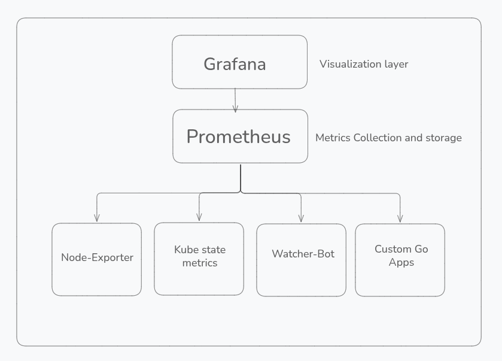

# Kubernetes Monitoring & Autoscaling System

A production-grade monitoring stack built from scratch using Prometheus, Grafana, and custom metrics exporters on Kubernetes. This project demonstrates infrastructure-as-code practices, Kubernetes operator patterns, and real-time autoscaling based on custom application metrics.

> **Blog Series**: I documented the entire journey of building this system. Check out [Phase 1: Building the Monitoring Stack](https://shivamchaubey.live/blog/building-a-kubernetes-monitoring-stack-from-scratch-phase-1/) for the detailed walkthrough.

## What This Project Does

Instead of relying on basic CPU/memory-based autoscaling, this system:
- Collects **custom application metrics** from a Go service
- Stores and queries them using **Prometheus**
- Makes **intelligent scaling decisions** based on real application behavior
- Automatically adjusts pod replicas through the **Kubernetes API**
- Visualizes everything in **Grafana dashboards**

The entire infrastructure is managed as code using **Terraform**, making it reproducible and version-controlled.

## Architecture





**Components**:
- **Prometheus**: Time-series database scraping metrics every 15s
- **Node Exporter**: Hardware and OS-level metrics from each node
- **Kube-State-Metrics**: Kubernetes object state metrics (pods, deployments, etc.)
- **Grafana**: Dashboards and alerting
- **WatcherBot**: Custom Go exporter exposing application metrics
- **Autoscaler** (Phase 4): Custom controller for intelligent scaling

## Tech Stack

- **Infrastructure**: Kubernetes (MicroK8s), Terraform
- **Monitoring**: Prometheus, Grafana, custom exporters
- **Programming**: Go (for custom metrics and autoscaling logic)
- **IaC**: Terraform (HCL)
- **CI/CD**: GitHub Actions (Phase 5)

## Project Structure

```
infrastructure/
├── k8s/                           # Kubernetes manifests (YAML)
│   ├── app.yaml                   # Sample application deployment
│   ├── ingress.yaml               # Ingress configuration
│   ├── postgres.yaml              # PostgreSQL setup
│   └── secrets.yaml               # Secrets management
│
├── monitoring/                    # Monitoring stack manifests
│   ├── grafana.yaml               # Grafana deployment + service
│   ├── grafana-pvc.yaml           # Persistent storage for dashboards
│   ├── prometheus-deployment.yaml # Prometheus server
│   ├── prometheus-config.yaml     # Scrape configs (what to monitor)
│   ├── prometheus-pvc.yaml        # Time-series data storage
│   ├── prometheus-rbac.yaml       # ServiceAccount + permissions
│   ├── prometheus-service.yaml    # ClusterIP service
│   ├── node-exporter-daemonset.yaml    # Node metrics (runs on every node)
│   ├── node-exporter-service.yaml
│   ├── kube-state-metrics.yaml    # K8s object metrics + RBAC
│   └── watcher-bot.yaml           # Custom app with /metrics endpoint
│
└── terraform/                     # Infrastructure as Code
    ├── main.tf                    # Provider configuration
    ├── monitoring.tf              # Complete monitoring stack in HCL
    ├── variables.tf               # Configurable parameters
    └── terraform.tfstate          # State management
```

## Getting Started

### Prerequisites

- Kubernetes cluster (I'm using MicroK8s, but any K8s works)
- `kubectl` configured
- Terraform >= 1.0
- (Optional) Helm if you want the easy route

### Option 1: Deploy with Kubernetes Manifests

This is the manual way  you learn exactly what's happening.

```bash
# Create monitoring namespace
kubectl create namespace monitoring

# Deploy Prometheus stack
kubectl apply -f infrastructure/monitoring/prometheus-rbac.yaml
kubectl apply -f infrastructure/monitoring/prometheus-config.yaml
kubectl apply -f infrastructure/monitoring/prometheus-pvc.yaml
kubectl apply -f infrastructure/monitoring/prometheus-deployment.yaml
kubectl apply -f infrastructure/monitoring/prometheus-service.yaml

# Deploy exporters
kubectl apply -f infrastructure/monitoring/node-exporter-daemonset.yaml
kubectl apply -f infrastructure/monitoring/node-exporter-service.yaml
kubectl apply -f infrastructure/monitoring/kube-state-metrics.yaml

# Deploy Grafana
kubectl apply -f infrastructure/monitoring/grafana-pvc.yaml
kubectl apply -f infrastructure/monitoring/grafana.yaml

# Deploy custom app (WatcherBot)
kubectl apply -f infrastructure/monitoring/watcher-bot.yaml
```

**Verify everything is running:**
```bash
kubectl get pods -n monitoring
kubectl get svc -n monitoring
```

### Option 2: Deploy with Terraform

This is the infrastructure-as-code approach  one command to rule them all.

```bash
cd infrastructure/terraform

# Initialize Terraform
terraform init

# Review what will be created
terraform plan

# Deploy the entire stack
terraform apply
```

**What Terraform creates:**
- `monitoring` namespace
- Prometheus with RBAC (ServiceAccount, ClusterRole, ClusterRoleBinding)
- Persistent volumes for Prometheus and Grafana
- Node Exporter DaemonSet (runs on all nodes)
- Kube-State-Metrics deployment
- Grafana deployment
- All required services

**Tear it down:**
```bash
terraform destroy
```

## Configuration Deep Dive

### Prometheus Scrape Targets

The `prometheus-config.yaml` defines what Prometheus monitors:

```yaml
scrape_configs:
  - job_name: 'prometheus'
    static_configs:
      - targets: ['localhost:9090']    # Prometheus monitoring itself
  
  - job_name: 'node-exporter'
    kubernetes_sd_configs:             # Auto-discovery of node exporters
      - role: endpoints
        namespaces:
          names: [monitoring]
    relabel_configs:
      - source_labels: [__meta_kubernetes_service_label_app]
        regex: node-exporter
        action: keep
  
  - job_name: 'kube-state-metrics'
    static_configs:
      - targets: ['ksm-service:8080']
  
  - job_name: 'watcherBot'
    static_configs:
      - targets: ['watcherBot-svc:8080']
```

**Key concepts:**
- **Static configs**: Hardcoded targets (simple, but not dynamic)
- **Kubernetes service discovery**: Prometheus finds targets automatically using K8s API
- **Relabel configs**: Filter which endpoints to scrape based on labels

### RBAC Setup

Prometheus needs permissions to discover and scrape Kubernetes resources. The RBAC setup grants it access to:

- **Nodes**: To discover node exporters
- **Pods/Services/Endpoints**: To scrape application metrics
- **ConfigMaps/Secrets**: (Read-only) For configuration

This is done via:
1. **ServiceAccount**: Identity for Prometheus pods
2. **ClusterRole**: Permissions definition
3. **ClusterRoleBinding**: Ties the ServiceAccount to the ClusterRole

### Resource Management

Each component has resource requests and limits to prevent resource contention:

```yaml
resources:
  requests:
    memory: "256Mi"
    cpu: "250m"
  limits:
    memory: "512Mi"
    cpu: "500m"
```

This ensures:
- Kubernetes can schedule pods efficiently
- No single component starves others
- Cluster remains stable under load

## Accessing the Stack

### Port Forwarding (Development)

```bash
# Prometheus
kubectl port-forward -n monitoring svc/prometheus-service 9090:80

# Grafana
kubectl port-forward -n monitoring svc/grafana-svc 3000:80
```

Then open:
- Prometheus: http://localhost:9090
- Grafana: http://localhost:3000 (default: admin/admin)

### NodePort (Production-ish)

If you used the Grafana manifest with NodePort:
```bash
# Get the node IP
kubectl get nodes -o wide

# Access Grafana at http://<NODE_IP>:32000
```

## Exploring Metrics

### 1. Verify Prometheus Targets

Go to Prometheus UI → Status → Targets

You should see all scrape jobs in **UP** state:
- prometheus
- node-exporter
- kube-state-metrics
- watcherBot

### 2. Query Some Metrics

Try these in the Prometheus query interface:

```promql
# CPU usage per node
rate(node_cpu_seconds_total{mode="idle"}[5m])

# Memory usage
node_memory_MemAvailable_bytes / node_memory_MemTotal_bytes

# Pod count per namespace
kube_pod_info

# Custom app metrics (from WatcherBot)
watcherbot_requests_total
```

### 3. Build Grafana Dashboards

1. Add Prometheus as a data source in Grafana
2. Import community dashboards:
   - **Node Exporter Full**: Dashboard ID `1860`
   - **Kubernetes Cluster Monitoring**: Dashboard ID `7249`
3. Create custom dashboards for your app metrics

## What I Learned (Phase 1 + 2)

### Technical Skills
- How Prometheus scrapes and stores time-series data
- Kubernetes RBAC and why every component needs a ServiceAccount
- The difference between DaemonSet (node-exporter) and Deployment (Prometheus)
- Why PersistentVolumes matter (Prometheus loses data on pod restart without them)
- Converting imperative kubectl commands to declarative Terraform

### The Hard Parts
- **RBAC debugging**: Spent 2 hours figuring out why Prometheus couldn't discover pods (missing `list` permission)
- **PVC issues**: MicroK8s needs `microk8s-hostpath` storage class, not `standard`
- **Terraform state management**: Learned the hard way that renaming resources breaks everything
- **Service discovery**: Understanding Kubernetes endpoints vs services vs pods

### Key Insights
- **Start simple**: I manually deployed everything first, then converted to Terraform
- **Check /metrics endpoints**: Before configuring Prometheus, verify the exporter actually exposes metrics
- **kubectl logs is your friend**: Most issues were configuration mistakes caught in logs
- **Terraform plan is free**: Always run it before apply

## Some Images of the execution


## Next Steps (Phases 3-6)

### Phase 3: Custom Go Metrics Exporter
Build a real application that exposes:
- Request count
- Response latency
- Custom business metrics (e.g., orders processed, user signups)

### Phase 4: Intelligent Autoscaling
Write a Go controller that:
- Queries Prometheus for custom metrics
- Makes scaling decisions (not just CPU-based)
- Updates Deployment replicas via K8s API
- Logs all actions for audit

### Phase 5: CI/CD Pipeline
- Dockerize the Go apps (multi-stage builds)
- GitHub Actions to build, test, push to registry
- Auto-deploy to K8s on merge to main

### Phase 6: Polish & Portfolio
- Clean documentation
- Architecture diagrams
- Demo video
- Blog post series

## Troubleshooting

### Prometheus targets are down
```bash
# Check pod logs
kubectl logs -n monitoring <prometheus-pod-name>

# Verify services exist
kubectl get svc -n monitoring

# Check if endpoints are registered
kubectl get endpoints -n monitoring
```

### Grafana won't connect to Prometheus
- Verify the Prometheus service name matches the data source URL
- Use `http://prometheus-service` (not `prometheus-service.monitoring.svc.cluster.local` unless you specify namespace)

### Terraform apply fails
```bash
# Reset state (DANGER: only in dev)
terraform destroy
rm -rf .terraform terraform.tfstate*
terraform init
terraform apply
```

## Resources

- [My Blog Post - Phase 1](https://shivamchaubey.live/blog/building-a-kubernetes-monitoring-stack-from-scratch-phase-1/)
- [Prometheus Docs](https://prometheus.io/docs/introduction/overview/)
- [Terraform Kubernetes Provider](https://registry.terraform.io/providers/hashicorp/kubernetes/latest/docs)
- [Kube-State-Metrics](https://github.com/kubernetes/kube-state-metrics)

## License

MIT  do whatever you want with this.

---

**Built by Shivam Chaubey** | [Website](https://shivamchaubey.live) | [GitHub](https://github.com/shivamchaubey027)

*This is a learning project documenting my journey from basics to building production-grade infrastructure. If you're also learning, feel free to reach out or open an issue.*
